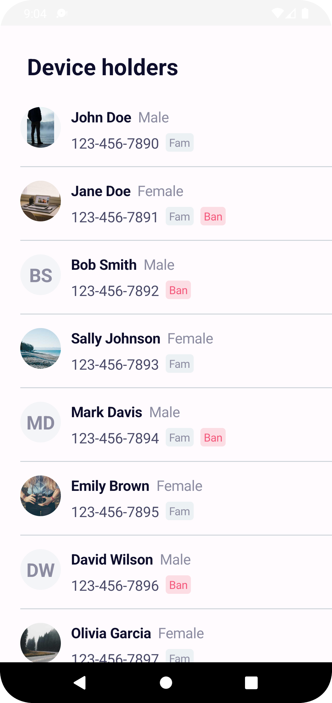
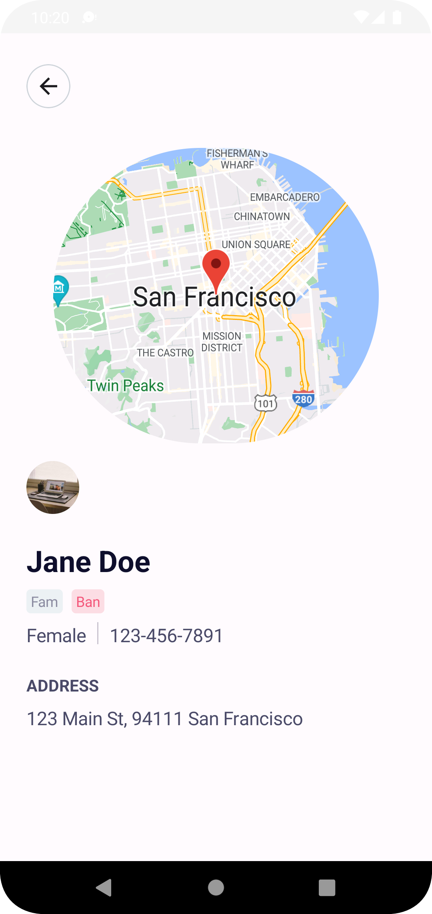

# Device Listing

Device Listing is application showcasing the device listing and customer details.

The main goal of this app is to be a sample of how to build an high quality Android application that uses the mutlimodule Architecture components,MVVM,Coroutines,Jetpack,Koin etc. in Kotlin.

## Development Approach
Selection of modularization approach to leverage the
- Reusability
- Scalability
- Testability
- Build time

## Architecture
The app uses MVVM [Model-View-ViewModel] architecture to have a unidirectional flow of data, separation of concern, testability, and a lot more.
- Koin is used for the dependency injection.
- Retrofit is used to api integration
- Feature module for the device list containing api, domain and presentation module
- Feature module for the Customer Details containing api, domain and presentation module
- core module have sub module for network layer
- Feature domain layer Implement usecase to get data from repository and repository fetch data from network layer
- View Model are the one responsible to communicate with the data layers with the help of usecases
- Navigation between the feature module is done with the help of dependency injection and defination are available in common module
- common module contains the compose theming and components. 

## UI
Application Design is based on Figma design provided. And UI is done using Jetpack Compose

Application have a two screen that is regarded as feature i.e. Customer List and Customer Details

### Device List
- Loading State. Displaying loader when screen is launched and network call is on the ongoing to fetch the data.
- Error State. Display snackbar if any error happen with retry button.
- Customer List Loaded. Display List of user if data is fetched successfully.
- Customer Details Screen. Upon clicking on customer item it navigate to the Customer Details screen.

### Customer Details
- Loading State. Displaying loader when screen is launched and network call is on the ongoing to fetch the data.
- Error State. Display snackbar if any error happen with retry button.
- Customer Details Loaded. Display Customer last known location on the google maps of user and other available if data is fetched successfully.

  
&nbsp; &nbsp; &nbsp; &nbsp;
  
&nbsp; &nbsp; &nbsp; &nbsp;

## Libraries used for feature development

<li><a href="https://developer.android.com/topic/libraries/architecture/viewmodel">ViewModel</a></li>
<li><a href="https://material.io/develop/android/docs/getting-started/">Material Design</a></li>
<li><a href="https://developer.android.com/kotlin/coroutines">Coroutines</a></li>
<li><a href="https://insert-koin.io/">Koin</a></li>
<li><a href="https://square.github.io/retrofit/">Retrofit</a></li>
<li><a href="https://github.com/google/gson">Gson</a></li>
<li><a href="https://developer.android.com/jetpack/compose">Jetpack Compose</a></li>

## Testing Strategies

Unit tests cover each module's 

- Usecase
- Repository
- ViewModels

Unit testing is done using Junit.
<li><a href="https://github.com/junit-team/junit4">Junit</a></li>
Integration testing can be done using Espresso.
<li><a href="https://developer.android.com/training/testing/espresso">Espresso</a></li>